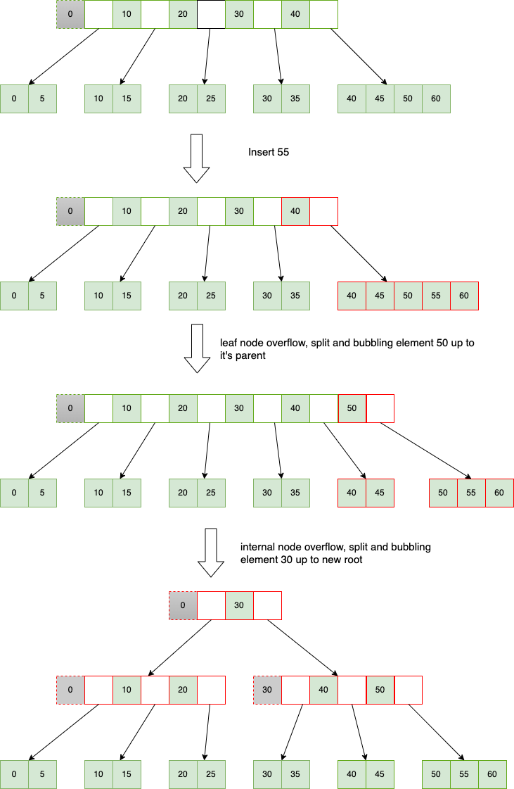
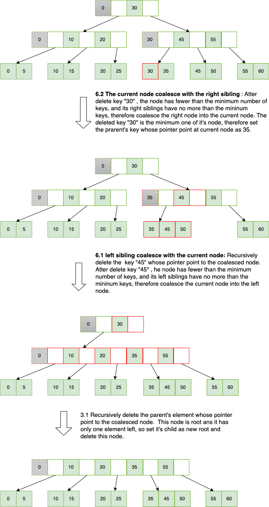

B + Tree is a variation of the B-tree data structure. In a B + tree, data pointers are stored only at the leaf nodes of the tree. In a B+ tree structure of a leaf node differs from the structure of internal nodes. The leaf nodes have an entry for every value of the search field, along with a data pointer to the record (or to the block that contains this record). The leaf nodes of the B+ tree are linked together to provide ordered access to the search field to the records. Internal nodes of a B+ tree are used to guide the search. Some search field keys from the leaf nodes are repeated in the internal nodes of the B+ tree.

## Structure of B+ Tree


B+ Trees contain two types of nodes:

- **Internal Nodes**: Internal Nodes have `n` keys  and `n+1` values(pointers) which point to child nodes. In actual implementation, the key number were also `n+1`, but the key at position 0 in an internal node is a virtual key, such as the gray one in the diagram above.  The virtual key conceptually represents the minimum key of the node, however, it may not necessarily have the minimum or even an actual value associated with it. Another noteworthy characteristic ,as illustrated in the diagram, is that the internal node's key equals the first key of it's child node to which its key's pointer points.
- **Leaf Nodes**: Leaf Nodes have `n` keys and `n` values.

### The Structure of the Internal Nodes of a B+ Tree of Order `n` is as Follows


1. Each internal node is of the form: `<K0 P0>, <K1 P1>, ..., <Km-1 Pm-1>, <Km Pm>` where `m < n+1` and each `Pi` is a tree pointer (i.e points to another node of the tree) and, each `Ki` is a key . 
2. Every internal node has : `K0 < K1 < … < Km`, for `m < n+1`
3. For each search field value ‘X’ in the sub-tree pointed at by `Pi`, the following condition holds: `Ki =< X < Ki+1` for `0 < i < m` , `X >= Ki` for `i = m`, and `X <= Ki` for `i = 0` 
4. Each internal node has  at most `n+1` tree pointers. The root node has at least two pointers, while the other internal nodes have at least `ceil(n/2)` tree pointers each.

###  The Structure of the Leaf Nodes of a B+ Tree of Order ‘n’ is as Follows


1. Each leaf node is of the form: `<K0, D0>, <K1, D1>, ... , <Km-1, Dm-1>, <Km, Dm>, P_next>` where `m <= n` and each `Di` is a data pointer (i.e points to actual record in the disk whose key value is `Ki` or to a disk file block containing that record) and,  `P_next` points to next leaf node in the B+ tree. Using the Pnext pointer it is viable to traverse all the leaf nodes, just like a linked list, thereby achieving ordered access to the records stored in the disk. 
2. Every leaf node has : `K0 < K1 < … < Km`, for `m < n`
3. Each leaf node has at least `ceil((n-1)/2)` and at most `n` values.
4. All leaf nodes are at the same level.


## Searching a Record in B+ Trees

Start from root , find the bigest index such that `key >= node.key_i`. Proceed to the next level of node via the pointer located at this index of the current node, until reaching the leaf node that houses the desired key.

```C
BPlusTreeSearch(key){
	node = root;
	while(!node.IsLeaf()){
		i = IndexOfKeyInInternalNode(node, key);
		if(i == -1) return null;
		node = DiskRead(node.elements[i].value);
	}


  i = IndexOfKeyInLeafNode(node, key);
  if(i == -1) return null;
  return node.elements[i];
}

IndexOfKeyInInternalNode(node, key) {
  for(i = node.Size()-1; i > 0 && key < node.elements[i].key; i--)
      ;
  return i;
}

IndexOfKeyInLeafNode(node, key) {
  for(i = 0, size = node.Size(); i < size; i++) {
    if(key == node.elements[i].key){
      return i;
    }
  }
  return -1;
}
```

## Insertion in B+ Trees

When an internal node contains 'n+1' keys or a leaf node contains 'n' keys, it is considered to be in an overflow state.


- 1 : Every element is inserted into a leaf node. So, go to the appropriate leaf node as described in "Searching a Record in B+ Trees" section.
- 2 : Insert the key into the leaf node in increasing order. 

If there is an overflow go ahead with the following steps mentioned below to deal with overflow while maintaining the B+ Tree properties.

- 3 : overflow happens  
	- 3.1 : Split the node into two nodes. First node contains `ceil((n-1)/2)` values. Second node contains the remaining values.
	- 3.2 : If the split node is not the root, we recursively insert the first element of the second node into its parent node. This process continues until we find a suitable place for the element or reach the root node.
	- 3.3 : However, if the split node is the root, we create a new node whose children are the two split nodes and make this node the new root of the tree. This means that the height of the tree increases by one.

## Insertion example
In this example `n=5`. As the diagram shows that I insert 55 in the tree, the leaf node overflows, it is split and the element, in this case 50, is copied up (bubbled up) to it's parent node. If the parent node is also full, this process continues recursively until a node with space is found or a new root is created.



## Deletion in B+ Tree

The minimum number of keys in a node is 'ceil((n-1)/2)', It is considered to be underflow if number of keys is less than minimum number .

The deletion strategy for the B+ tree is as follows:


- 1 : Locate the deleted key in the leaf nodes throught searching method.
- 2 : Delete the key and its associated value if the key is discovered in a leaf node.
- 3 : If the current node is root, proceed to step 3.1-3.2. Otherwise, proceed to step 4.
	- 3.1 : If the root is a internal node and contains only one child node then set the child node as the new root node and delete the original root node. This means that the height of the tree decreases by one. 
	- 3.2 : The deletion process is end.
- 4 : If the node dose not underflows, assigne the parent's key whose pointer points to the current node as the first key of the current node to handle the case where the deleted key happens to be the minimum key of the current node prior to deletion. Otherwise continue to the next step.

- 5 : Borrow from slibing node  
If any sibling node contains more keys than the required minimum, we can borrow a key from that sibling node.
	- 5.1 : borrow from left slibing node  
	When borrowing from the left, the last element of the left node is transferred to the current node. Assigne the parent's key whose pointer points to the current node as the first key(the borrowed one) of the current node.
	- 5.2 : borrow from right slibing node  
	When borrowing from the right, the first element from the right node is transferred to the current node. Consequently, the key in the parent node, whose pointer points to the right node, should be assigned as the new first key (the second key before the transfer) of the right node. Assigne the parent's key whose pointer points to the current node as the first key of the current node to handle the case where the deleted key happens to be the minimum key of the current node prior to deletion.

- 6 : Coalesce with slibing node  
If neither of the node's sibling nodes has more than the required minimum number of keys, then it should be coalesced with one of its sibling nodes.

	- 6.1 : left sibling node coalesce with the current node  
	If the left node is not null, the current node is coalesced into the left node, following which the current node is deleted. Recursively deleted the parent's key whose pointer points to the deleted node.

	- 6.2 : the current node coalesce with the right sibling node  
	If the right node is not null, it is coalesced into the current node, following which the right node is deleted. Assigne the parent's key whose pointer points to the current node as the first key of the current node to handle the case where the deleted key happens to be the minimum key of the current node prior to deletion. Recursively deleted the parent's key whose pointer points to the deleted node.

## Deletion example
In the following examples `n=5`.

### Example for borrow from right slibing node 


### Example for coalesce with slibing node 



> https://www.cs.usfca.edu/~galles/visualization/BPlusTree.html


 
