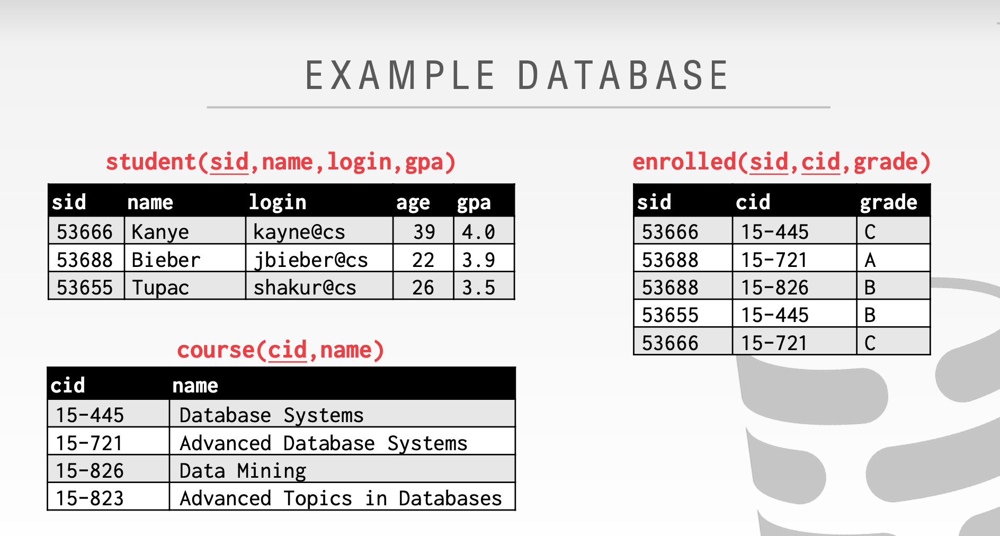

## aggregate
### having
The following sql is error, since SELECT execute on the condition of WHERE clause, but the WHERE condition in the following sql depends on the result of aggregate function AVG in the SELECT clause.
```sql
SELECT AVG(s.gpa) AS avg_gpa, e.cid  FROM enrolled AS e, student AS s
WHERE e.sid = s.sid and avg_gpa > 3.9 GROUP BY e.cid;
```

It should be write as following, in this case HAVING always execute after SELECT clause has completed execution.
```sql
SELECT AVG(s.gpa) AS avg_gpa, e.cid  FROM enrolled AS e, student AS s
WHERE e.sid = s.sid GROUP BY e.cid HAVING avg_gpa > 3.9;
```


## DATE/TIME

### timestamp of now
for postgresql / mysql
```sql
SELECT NOW();
```

for postgresql / mysql / sqlite / sqlserver
```sql
SELECT CURRENT_TIMESTAMP;
```

### extract day from timestamp
for postgresql
```sql
SELECT EXTRACT(DAY FROM DATE('2020-09-01'));
```

### calculate days between two timestamp
for  postgresql
```sql
SELECT DATE('2020-09-01') - DATE('2020-01-01') AS days;
```
for mysql
```sql
SELECT ROUND((UNIX_TIMESTAMP(DATE('2020-09-01')) - UNIX_TIMESTAMP(DATE('2020-01-01'))) / (60*60*24), 0) AS days;

SELECT DATEDIFF(DATE('2020-09-01') , DATE('2020-01-01')) AS days;

```

for sqlite
```sql
SELECT CAST(julianday(DATE('2020-09-01')) - julianday(DATE('2020-01-01')) AS INT) AS days;
```
for sqlserver
```sql
SELECT DATEDIFF(DAY, '2020-01-01', '2020-09-01');
```


## Nested queries

- ALL: 所有 inner queries 返回的记录都必须满足条件
- ANY：任意 inner queries 返回的记录满足条件即可
- IN：与 ANY 等价
- EXISTS：inner queries 返回的表不为空

 
Demo : Find all the student's name who has enrolled the course '15-445'
```sql
SELECT name FROM student WHERE sid = ANY(
	SELECT sid FROM enrolled WHERE cid = '15-445'
)
```
The above sql is equivalent to the following sql, but the latter outperforms the former. In the former's query, every time the outer SELECT it must excute the inner query once more. In the latter's query, "WHERE cid='15-445'" only excute once, then the inner query use the JOIN method to query every student that has the sid equals the sid that has been find in the outer query.
```sql
SELECT (SELECT S.name FROM student AS S WHERE S.sid = E.sid) AS sname
FROM enrolled AS E
WHERE cid='15-445';

```

 
Demo: find all the course that no student has ever enrolled.
```sql
SELECT * FROM course WHERE NOT EXISTS(
	SELECT * FROM enrolled WHERE course.cid = enrolled.cid
)
```
Note: The inner query can reference the outer query, but the outer query can not reference the inner query. In this example the inner query can reference the 'course' of the outer query.


## Window Functions
Window Functions is sort of like Aggregation Functions, but instead of aggregation multiple rows as one row, it compute every row's Window Function.
PARTITION keyword in Window Functions corresponse to the GROUP keyword in Aggregation Functions.
 
Special window functions:
- ROW_NUMBER()→ # of the current row
- RANK()→ Order position of the current row.

Demo: Find the student with the highest grade for each course.
```sql
SELECT * FROM (
  SELECT *,
         RANK() OVER (PARTITION BY cid ORDER BY grade ASC) AS rank
    FROM enrolled
  ) AS ranking
WHERE ranking.rank = 1;
```

## Common Table Expressions
Provides a way to write auxiliary statements for use in a larger query. Think of it like a temp table just for one query. Alternative to nested queries and views.
```sql
WITH cteName AS (
    SELECT 1
)
SELECT * FROM cteName
```

You can bind output columns to names before the AS keyword.
```sql
WITH cteName (col1, col2) AS (
	SELECT 1, 2
)
SELECT col1 + col2 FROM cteName
```

Find student record with the highest id that is enrolled in at least one course.
```sql
WITH cteSource(maxId) AS (
    SELECT MAX(sid) FROM enrolled
)
SELECT name FROM student, cteSource
 WHERE student.sid = cteSource.maxId
```

Print the sequence of numbers from 1 to 10.
```sql
WITH  cteSource (counter) AS (
    SELECT 1
    UNION ALL
    SELECT counter + 1 FROM cteSource WHERE counter < 10
)
SELECT * FROM cteSource;
```


