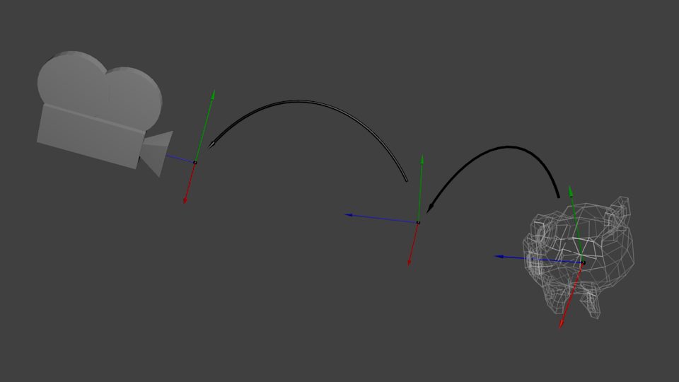
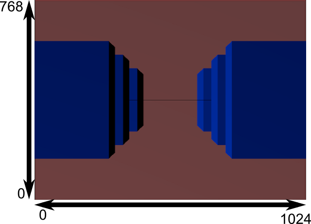

> _The engines don’t move the ship at all. The ship stays where it is and the engines move the universe around it.           ---- Futurama

## Homogeneous coordinates
Until then, we only considered 3D vertices as a `(x,y,z)` triplet. Let’s introduce w. We will now have `(x,y,z,w)` vectors.

This will be more clear soon, but for now, just remember this:
- If w == 1, then the vector (x,y,z,1) is a position in space.
- If w == 0, then the vector (x,y,z,0) is a direction.

(In fact, remember this forever.)

What difference does this make? Well, for a rotation, it doesn’t change anything. When you rotate a point or a direction, you get the same result. However, for a translation (when you move the point in a certain direction), things are different. What could mean “translate a direction”? Not much.

Homogeneous coordinates allow us to use a single mathematical formula to deal with these two cases.

## Translation matrices


These are the most simple tranformation matrices to understand. A translation matrix look like this:


where X,Y,Z are the values that you want to add to your position.

So if we want to translate the vector (10,10,10,1) of 10 units in the X direction, we get:


…and we get a (20,10,10,1) homogeneous vector! Remember, the 1 means that it is a position, not a direction. So our transformation didn’t change the fact that we were dealing with a position, which is good.

Let’s now see what happens to a vector that represents a direction towards the -z axis: (0,0,-1,0)


…i.e. our original (0,0,-1,0) direction, which is great because, as I said earlier, moving a direction does not make sense.

So, how does this translate to code?

**In C++, with GLM:**

```c++
#include <glm/gtx/transform.hpp> // after <glm/glm.hpp>

glm::mat4 myMatrix = glm::translate(glm::mat4(), glm::vec3(10.0f, 0.0f, 0.0f));
glm::vec4 myVector(10.0f, 10.0f, 10.0f, 0.0f);
glm::vec4 transformedVector = myMatrix * myVector; // guess the result
```

**In GLSL:**

```c
vec4 transformedVector = myMatrix * myVector;
```

Well, in fact, you almost never do this in GLSL. Most of the time, you use `glm::translate()` in C++ to compute your matrix, send it to GLSL, and do only the multiplication.

## The Identity matrix

This one is special. It doesn’t do anything. But I mention it because it’s as important as knowing that multiplying A by 1.0 gives A.


**In C++:**

```c++
glm::mat4 myIdentityMatrix = glm::mat4(1.0f);
```

## Scaling matrices

Scaling matrices are quite easy too:


So if you want to scale a vector (position or direction, it doesn’t matter) by 2.0 in all directions:


and the w still didn’t change. You may ask: what is the meaning of “scaling a direction”? Well, often, not much, so you usually don’t do such a thing, but in some (rare) cases it can be handy.

(notice that the identity matrix is only a special case of scaling matrices, with (X,Y,Z) = (1,1,1). It’s also a special case of translation matrix with (X,Y,Z)=(0,0,0), by the way)

**In C++:**

```c++
// Use #include <glm/gtc/matrix_transform.hpp> and #include <glm/gtx/transform.hpp>
glm::mat4 myScalingMatrix = glm::scale(glm::mat4(1), glm::vec3(2,2,2));
```
## Rotation matrices

These are quite complicated. I’ll skip the details here, as it’s not important to know their exact layout for everyday use. For more information, please have a look to the [Matrices and Quaternions FAQ](https://www.opengl-tutorial.org/assets/faq_quaternions/index.html) (popular resource, probably available in your language as well). You can also have a look at the [Rotations tutorials](https://www.opengl-tutorial.org/intermediate-tutorials/tutorial-17-quaternions).

**In C++:**

```c++
// Use #include <glm/gtc/matrix_transform.hpp> and #include <glm/gtx/transform.hpp>
glm::vec3 myRotationAxis(??,??,??);
glm::rotate( angle_in_degrees, myRotationAxis );
```
## Cumulating transformations

So now we know how to rotate, translate, and scale our vectors. It would be great to combine these transformations. This is done by multiplying the matrices together, for instance:

```
TransformedVector = TranslationMatrix * RotationMatrix * ScaleMatrix * OriginalVector;
```

**!!! BEWARE!!!** This lines actually performs the scaling FIRST, and THEN the rotation, and THEN the translation. This is how matrix multiplication works.

Try it yourself:

- make one step ahead (beware of your computer) and turn left;
    
- turn left, and make one step ahead
    

Writing the operations in another order wouldn’t produce the same result. As a matter of fact, the order above is what you will usually need for game characters and other items: Scale it first if needed; then set its direction, then translate it. For instance, given a ship model (rotations have been removed for simplification):

- The wrong way:
    - You translate the ship by (10,0,0). Its center is now at 10 units of the origin.
    - You scale your ship by 2. Every coordinate is multiplied by 2 _relative to the origin_, which is far away… So you end up with a big ship, but centered at 2*10 = 20. Which you don’t want.
- The right way:
    - You scale your ship by 2. You get a big ship, centered on the origin.
    - You translate your ship. It’s still the same size, and at the right distance.

Matrix-matrix multiplication is very similar to matrix-vector multiplication, so I’ll once again skip some details and redirect you the the [Matrices and Quaternions FAQ](https://www.opengl-tutorial.org/assets/faq_quaternions/index.html#Q11) if needed. For now, we’ll simply ask the computer to do it:

**in C++, with GLM:**

```c++
glm::mat4 myModelMatrix = myTranslationMatrix * myRotationMatrix * myScaleMatrix;
glm::vec4 myTransformedVector = myModelMatrix * myOriginalVector;
```

**in GLSL:**

```
mat4 transform = mat2 * mat1;
vec4 out_vec = transform * in_vec;
```

# The Model, View and Projection matrices

_For the rest of this tutorial, we will suppose that we know how to draw Blender’s favourite 3d model: the monkey Suzanne._

The Model, View and Projection matrices are a handy tool to separate transformations cleanly.  

## The Model matrix

This model, just as our beloved red triangle, is defined by a set of vertices. The X,Y,Z coordinates of these vertices are defined relative to the object’s center: that is, if a vertex is at (0,0,0), it is at the center of the object.


We’d like to be able to move this model, maybe because the player controls it with the keyboard and the mouse. Easy, you just learnt do do so: `translation\*rotation\*scale`, and done. You apply this matrix to all your vertices at each frame (in GLSL, not in C++!) and everything moves. Something that doesn’t move will be at the _center of the world_.


Your vertices are now in _World Space_. This is the meaning of the black arrow in the image below: _We went from Model Space (all vertices defined relatively to the center of the model) to World Space (all vertices defined relatively to the center of the world)._


We can sum this up with the following diagram:


## The View matrix

Let’s quote Futurama again:

> _The engines don’t move the ship at all. The ship stays where it is and the engines move the universe around it._


So initially your camera is at the origin of the World Space. In order to move the world, you simply introduce another matrix. Let’s say you want to move your camera of 3 units to the right (+X). This is equivalent to moving your whole world (meshes included) 3 units to the LEFT! (-X). While you brain melts, let’s do it:

```c++
// Use #include <glm/gtc/matrix_transform.hpp> and #include <glm/gtx/transform.hpp>
glm::mat4 ViewMatrix = glm::translate(glm::mat4(), glm::vec3(-3.0f, 0.0f ,0.0f));
```

Again, the image below illustrates this: _We went from World Space (all vertices defined relatively to the center of the world, as we made so in the previous section) to Camera Space (all vertices defined relatively to the camera)._



Before you head explodes from this, enjoy GLM’s great `glm::lookAt` function:

```c++
glm::mat4 CameraMatrix = glm::lookAt(
    cameraPosition, // the position of your camera, in world space
    cameraTarget,   // where you want to look at, in world space
    upVector        // probably glm::vec3(0,1,0), but (0,-1,0) would make you looking upside-down, which can be great too
);
```

Here’s the compulsory diagram:


This is not over yet, though.

## The Projection matrix

We’re now in Camera Space. This means that after all theses transformations, a vertex that happens to have `x==0` and `y==0` should be rendered at the center of the screen. But we can’t use only the x and y coordinates to determine where an object should be put on the screen: its distance to the camera (z) counts, too! For two vertices with similar x and y coordinates, the vertex with the biggest z coordinate will be more on the center of the screen than the other.

This is called a perspective projection:


And luckily for us, a 4x4 matrix can represent this projection:

```c++
// Generates a really hard-to-read matrix, but a normal, standard 4x4 matrix nonetheless
glm::mat4 projectionMatrix = glm::perspective(
    glm::radians(FoV), // The vertical Field of View, in radians: the amount of "zoom". Think "camera lens". Usually between 90° (extra wide) and 30° (quite zoomed in)
    4.0f / 3.0f,       // Aspect Ratio. Depends on the size of your window. Notice that 4/3 == 800/600 == 1280/960, sounds familiar?
    0.1f,              // Near clipping plane. Keep as big as possible, or you'll get precision issues.
    100.0f             // Far clipping plane. Keep as little as possible.
);
```

One last time:

_We went from Camera Space (all vertices defined relatively to the camera) to Homogeneous Space (all vertices defined in a small cube. Everything inside the cube is onscreen)._

And the final diagram:


Here’s another diagram so that you understand better what happens with this Projection stuff. Before projection, we’ve got our blue objects, in Camera Space, and the red shape represents the frustum of the camera: the part of the scene that the camera is actually able to see.


Multiplying everything by the Projection Matrix has the following effect:


In this image, the frustum is now a perfect cube (between -1 and 1 on all axes, it’s a little bit hard to see it), and all blue objects have been deformed in the same way. Thus, the objects that are near the camera ( = near the face of the cube that we can’t see) are big, the others are smaller. Seems like real life!

Let’s see what it looks like from the “behind” the frustum:


Here you get your image! It’s just a little bit too square, so another mathematical transformation is applied (this one is automatic, you don’t have to do it yourself in the shader) to fit this to the actual window size:



And this is the image that is actually rendered!

## Cumulating transformations: the ModelViewProjection matrix

…Just a standard matrix multiplication as you already love them!

```c++
// C++: compute the matrix
glm::mat4 MVPmatrix = projection * view * model; // Remember: inverted!
```

```
// GLSL: apply it
transformed_vertex = MVP * in_vertex;
```

# Putting it all together

- First step: include the GLM GTC matrix transform functions:

```c++
#include <glm/gtc/matrix_transform.hpp>
```

- Second step: generating our MVP matrix. This must be done for each model you render.

```c++
// Projection matrix: 45° Field of View, 4:3 ratio, display range: 0.1 unit <-> 100 units
glm::mat4 Projection = glm::perspective(glm::radians(45.0f), (float) width / (float)height, 0.1f, 100.0f);

// Or, for an ortho camera:
//glm::mat4 Projection = glm::ortho(-10.0f,10.0f,-10.0f,10.0f,0.0f,100.0f); // In world coordinates

// Camera matrix
glm::mat4 View = glm::lookAt(
    glm::vec3(4,3,3), // Camera is at (4,3,3), in World Space
    glm::vec3(0,0,0), // and looks at the origin
    glm::vec3(0,1,0)  // Head is up (set to 0,-1,0 to look upside-down)
    );

// Model matrix: an identity matrix (model will be at the origin)
glm::mat4 Model = glm::mat4(1.0f);
// Our ModelViewProjection: multiplication of our 3 matrices
glm::mat4 mvp = Projection * View * Model; // Remember, matrix multiplication is the other way around
```
    
- Third step: give it to GLSL
    
```c++
// Get a handle for our "MVP" uniform
// Only during the initialisation
GLuint MatrixID = glGetUniformLocation(programID, "MVP");

// Send our transformation to the currently bound shader, in the "MVP" uniform
// This is done in the main loop since each model will have a different MVP matrix (At least for the M part)
glUniformMatrix4fv(MatrixID, 1, GL_FALSE, &mvp[0][0]);
```
    
- Fourth step: use it in GLSL to transform our vertices in `SimpleVertexShader.vertexshader`
    
```
// Input vertex data, different for all executions of this shader.
layout(location = 0) in vec3 vertexPosition_modelspace;

// Values that stay constant for the whole mesh.
uniform mat4 MVP;

void main(){
  // Output position of the vertex, in clip space: MVP * position
  gl_Position =  MVP * vec4(vertexPosition_modelspace,1);
}
```


> https://www.opengl-tutorial.org/beginners-tutorials/tutorial-3-matrices/