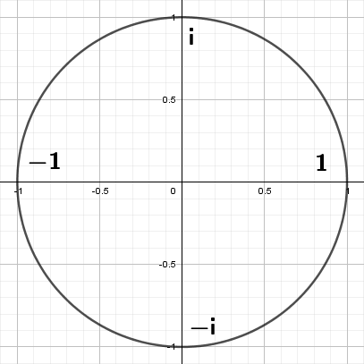
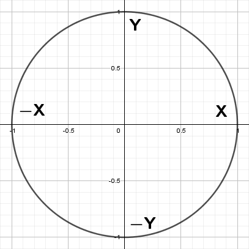
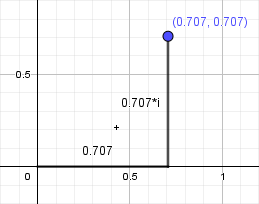
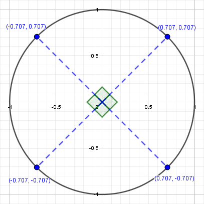

Readers are recommended to have read the [Rodrigues' rotation](../Rodrigues'%20rotation/Rodrigues'%20rotation.md) article ahead of time as it will be used to compare results.
## Crash course on imaginary/complex numbers

Before we can get into understanding quaternions we first need to understand the concept of imaginary and complex numbers. The names might seem daunting, but for our purposes the concepts are pretty straight forward. 

Imaginary numbers have a very simple purpose, to solve equations that real numbers couldn’t! For example: 
$$x^2 + 25 = 0$$
There is no real number solution to this equation because any real number we take to the power of two will result in a positive number. So in order for the above equation to be true it must be that:
$$x^2 = -25$$
This is what we call an imaginary number. They are special in the sense that they square to a real negative value. So far we have used $x$ as a variable, but usually when representing imaginary numbers we use what is called the imaginary unit `i` where $i^2 = -1$. That way we can represent any imaginary number as a product of a real number and `i`. For example:
$$(5*i)^2 + 25 = 25*(i^2) + 25 = -25 + 25 = 0$$
You might notice that the imaginary unit has a pattern when taken to different powers:

| Power Pattern |
| ------------- |
| $i^0 = 1$     |
| $i^1 = i$     |
| $i^2 = -1$    |
| $i^3 = -i$    |
| $i^4 = 1$     |
| $i^5 = i$     |
| $i^6 = -1$    |
| $i^7 = -i$    |
| ...           |
You'll note that this pattern also holds true for negative powers. Simply take notice that $i^{-1} = (1/i) * (i/i) = i/i^2 = i/-1 = -i$ and the rest of the negative powers become trivial to calculate.

This pattern of `1, i, -1, -i` may feel familiar to you. If we treat the real number part of the pattern as being on the x-axis and the imaginary parts as being on the y-axis then the pattern is essentially the same as `x , y, -x, -y` which is rotating 90 degrees counter-clockwise.





Since these patterns share so much in common we can use a combination of imaginary and real numbers to represent numbers on a two dimensional grid. We call these complex numbers and we place them on the complex plane.



Interestingly, if we multiply a complex number by `i` we're left with a resulting complex number that has been rotated 90 degrees counter-clockwise.

$$
\begin{align}
& (2 + i) \\ 
& (2 + i)*i = 2*i + i^2 = -1 + 2*i \\ 
& (2 + i)*i^2 = (-1 + 2*i)*i = -i + 2*i^2 = -2 - i \\
& (2 + i)*i^3 = (-2 - i)*i = -2*i - i^2 = 1 - 2*i \\
& (2 + i)*i^4 = (1 - 2*i)*i = i - 2*i^2 = 2 + i \\
\end{align}
$$



We can expand on this concept by instead multiplying with a complex number that gives us control of the angle we rotate by.

We can trace a unit circle with $cosθ + sinθ*i$ so if we multiply it by a complex number we get a general formula for rotating counter-clockwise by any angle, we call this a rotor.

$$
\begin{align}
 (w + xi)*(cosθ + sinθ*i) 
& = w*cosθ + w*sinθ*i + x*cosθ*i + x*sinθ*i^2 \\
& = w*cosθ - x*sinθ + (w*sinθ + x*cosθ)i \\
\end{align}
$$

You might be somewhat familiar with this formula. It's just the 2D rotation matrix in complex number form!

## The quaternion is born

Prior to quaternions most people saw the complex plane in 2D and simply figured if they wanted to add a third dimension they just had to add another imaginary number, say $j^2 = -1$. Quickly however they found this didn't quite work due to multiplication requiring us to know the product of two imaginary numbers.
$$
\begin{flalign*}
(w_1 + x_1 i + y_1 j)(w_2 + x_2 i + y_2 j)  &= w_1 w_2 + w_1 x_2 i + w_1 y_2 j &\\ 
& \quad + x_1 w_2 i + x_1 x_2 i^2 + x_1 y_2 ij \\ 
& \quad + y_1 w_2 j + y_1 x_2 ji + y_1 y_2 j^2 \\
&= w_1 w_2 - x_1 x_2 - y_1 y_2 \\
& \quad + (w_1 x_2 + x_1 w_2)i \\
& \quad + (w_1 y_2 + y_1 w_2)j  \\
& \quad + x_1 y_2 ij + y_1 x_2 ji
\end{flalign*}
$$
> Note: $ij$ and $ji$ are not commutative due to their imaginary nature. 

For quite sometime this problem didn't see much attention until an Irish mathematician named William Rowan Hamilton who figured the best way to solve it was to add a third imaginary number. 

Famously the condition he wrote was:

$$
i^2 = j^2 = k^2 = i*j*k = -1
$$

This may seem a bit confusing, but it we separate this out (and again respect the non-commutativity) we get a few equalities we can use to expand.

```
i^2 = -1	j^2 = -1	k^2 = -1
i*j = k		j*k = i		k*i = j
j*i = -k	k*j = -i	i*k = -j
```

In short Hamilton said that instead of stumping ourselves by not knowing a real number that is the resulting product of two imaginary numbers just set its product to another imaginary number and from there we can figure stuff out.

##   Quaternion Operations (Add & Multiplication)

We have quaternions in the following form:

$$
q = w + xi + yj + zk
$$

We can store that same information as an ordered pair by splitting up the real number part from the imaginary part. Thus the above becomes:

$$
q = [w, xi + yj + zk]
$$

If we treat `i`, `j`, and `k` as separate axes then we can store the second element of the ordered pair as a 3 dimensional vector, We can also write q as:

$$
\begin{align}
& q = [w, \vec{v}]
\end{align}
$$

where $w$ is the scalar part and $\vec{v} = (x, y, z)$ is the vector part.


Let 
$$q_1 = [w_1, \vec{v_1}] \qquad  q_2 = [w_2, \vec{v_2}]$$

If we wanted to add or subtract two quaternions its quite straight forward. We just add/subtract each individual component.

$$
\begin{align}
& q_1 + q_2 = [w_1 + w_2, \vec{v_1} + \vec{v_2}] \\
& q_1 - q_2 = [w_1 - w_2, \vec{v_1} - \vec{v_2}] \\
\end{align}
$$

Multiplication is not quite as simple as addition and subtraction. We can figure out how to do this calculation by applying the equalities Hamilton's equation.

$$
\begin{flalign*}
q_1 * q_2 &=[w₁, \vec{v₁}]*[w₂, \vec{v₂}] &\\
		&= (w_1 + x_1i + y_1j + z_1k)(w_2 + x_2i + y_2j + z_2k) & \\
		& \text{Expanding​ using the distributive property} \\
        &= w_1w_2 + w_1(x_2i + y_2j + z_2k)  \\
        & \quad + x_1w_2i + x_1x_2i^2 + x_1y_2ij + x_1z_2ik \\
        & \quad + y_1w_2j + y_1x_2ji + y_1y_2j^2 + y_1z_2jk \\
        & \quad + z_1w_2k + z_1x_2ki + z_1y_2kj + z_1z_2k^2 \\
        &= w_1w_2 - x_1x_2 - y_1y_2 - z_1z_2 \\
        & \quad + w_1(x_2i + y_2j + z_2k) + w_2(x_1i + y_1j + z_1k) \\
        & \quad + x_1y_2k - x_1z_2j - y_1x_2k + y_1z_2i + z_1x_2j - z_1y_2i \\
        &=[w₁w₂ - \vec{v₁}·\vec{v₂}, \; w₁\vec{v₂} + w₂\vec{v₁} + \vec{v₁}×\vec{v₂}]
\end{flalign*}
$$
## Definitions
###  Quaternion Conjugate and Inverse

- The **conjugate** of $q = [w, \vec{v}]$ is $\bar{q} = [w, -\vec{v}]$.
- The **norm** (magnitude squared) is $||q||² = ||q \bar{q}|| = w² + x² + y² + z²$.
- The **inverse** is $q⁻¹ = \bar{q} / ||q||²$.

We can use Multiplication form of the equation to find :
 
$$
\begin{flalign*}
q * \bar{q} &= [w² + (\vec{v} . \vec{v}), \, w\vec{v} - w\vec{v} + (\vec{v} \times \vec{v})] & \\
         &= [w² + (\vec{v} . \vec{v}), \, (0, 0, 0)] & \\
         &= [w² + x² + y² + z², \, (0, 0, 0)]
\end{flalign*}
$$

$$
\begin{flalign*}
q * q^{-1} &=  (q * \bar{q}) / ||q||² & \\
           &= [1, (0, 0, 0)] 
\end{flalign*}
$$ 
### Representing a 3D Vector

A 3D vector $\vec{p} = (p_x, p_y, p_z)$ is represented as a **pure quaternion**, which is a quaternion with a zero scalar part:  
$$p = 0 + p_xi + p_yj + p_zk = [0, \vec{p}]$$

###  The Unit Rotation Quaternion

For a rotation by angle θ around a **unit vector** axis $\vec{u} = (u_x, u_y, u_z)$, the corresponding **unit quaternion** (||q|| = 1) is:  
$$q = [cos(θ/2), sin(θ/2) \vec{u}] $$ 
Since ||q|| = 1, its inverse is simply its conjugate: $q⁻¹ = \bar{q}$ 
## Prove the validity of Quaternions


Let $q = [w, \vec{v}]$, where w = cos(θ/2) , $\vec{v} = sin(θ/2) * \vec{u}$ and  $\vec{u}$ is a unit vector.  
Let $p = [0, \vec{p}]$.
 

The **Quaternion Formula**
$$p' = q p \bar{q}$$
gives the result $p'$ of rotating the vector represented by the pure quaternion $p$ around the axis $\vec{v}$ by an angle θ.

The **Rodrigues' Rotation Formula**
$$\vec{p_{rot}} = \vec{p}cosθ + (\vec{u} \times \vec{p})sinθ + \vec{u}(\vec{u} ⋅ \vec{p})(1 - cosθ)$$
gives the result $\vec{p_{rot}}$ of rotating a vector $\vec{p}$ around a unit vector axis $\vec{u}$ by an angle θ.

If we can show that the vector part of $p'$ equals $\vec{p_{rot}}$, we have proven the validity of quaternion rotation.
 
###  Expanding the Quaternion Product

#### Part A: Calculate $q p$
 
Using the general quaternion multiplication rule $$[w₁, \vec{v₁}][w₂, \vec{v₂}] = [w₁*w₂ - \vec{v₁}·\vec{v₂}, w₁*\vec{v₂} + w₂*\vec{v₁} + \vec{v₁}×\vec{v₂}]$$we get:  
$$
\begin{align}
q p & = [w, \vec{v}] * [0, \vec{p}] \\
& = [w*0 - \vec{v} ⋅ \vec{p}, \; w*\vec{p} + 0* \vec{v} + \vec{v} \times \vec{p}]  \\
 & = [-\vec{v} ⋅ \vec{p}, \; w\vec{p} + \vec{v} × \vec{p}]
\end{align}
$$

#### Part B: Calculate $(q p) \bar{q}$

Now we multiply the result from Part A by $\bar{q} = [w, -\vec{v}]$.  
Let $q p = [w', \vec{v'}]$ where $w' = -\vec{v} ⋅ \vec{p}$ and $\vec{v'} = w\vec{p} + \vec{v} × \vec{p}$.
$$
\begin{align}
p' &= [w', \, \vec{v'}] [w, \, -\vec{v}]  \\
  &= [w'w - \vec{v'} ⋅ -\vec{v}), \, w'\vec{v} + w\vec{v'} + \vec{v'} \times -\vec{v}] \\
 &= [w'w + \vec{v'} ⋅ \vec{v}, \, -w'\vec{v} + w\vec{v'} - \vec{v'} \times\vec{v}]
\end{align}
$$

The final result $p'$ should be a pure quaternion (representing the rotated vector). Let's prove its scalar part is zero.  
$$
\begin{align}
Scalar \, part &=w'w + \vec{v'} ⋅ \vec{v} \\ 
&= (-\vec{v} ⋅ \vec{p})w + (w\vec{p} + \vec{v} × \vec{p}) ⋅ \vec{v}   \hspace{1cm} \text{ Substitute w' and v' } \\
&= -w(\vec{v} ⋅ \vec{p}) + w(\vec{p} ⋅ \vec{v}) + (\vec{v} × \vec{p}) ⋅ \vec{v}  
\end{align}
$$
The term$(\vec{v} × \vec{p}) ⋅ \vec{v}$ is the dot product of a vector with the result of a cross product involving that same vector. The result of $\vec{v} × \vec{p}$ is a vector orthogonal to $\vec{v}$. The dot product of two orthogonal vectors is zero.  
So,  $Scalar \, part= -w(\vec{v} ⋅ \vec{p}) + w(\vec{p} ⋅ \vec{v}) + 0 = 0$.  
**This confirms p' is a pure quaternion, as required.**

Now for the complex part. The vector part is: $-w'\vec{v} + w\vec{v'} - \vec{v'} \times\vec{v}$.  
Substitute w', $\vec{v'}$, w, and $\vec{v}$:

1. $-w'\vec{v} = -(-\vec{v} ⋅ \vec{p}) \vec{v} = (\vec{v} ⋅ \vec{p}) \vec{v}$
2. $w\vec{v'} = w(w\vec{p} + \vec{v} × \vec{p}) = w²\vec{p} + w(\vec{v} × \vec{p})$
3. $- \vec{v'} × \vec{v} = -(w\vec{p} + \vec{v} × \vec{p}) × \vec{v} = -(w(\vec{p} × \vec{v}) + (\vec{v} × \vec{p}) × \vec{v})$
     Using the vector triple product identity $(\vec{a} × \vec{b}) × \vec{c} = (\vec{a} ⋅ \vec{c})\vec{b} - (\vec{b} ⋅ \vec{c})\vec{a}$:
     $(\vec{v} × \vec{p}) × \vec{v} = (\vec{v} ⋅ \vec{v}) \vec{p} - (\vec{p} ⋅ \vec{v}) \vec{v} = ||\vec{v}||²\vec{p} - (\vec{p} ⋅ \vec{v}) \vec{v}$
     So, $-(\vec{v'} × \vec{v}) = -w(\vec{p} × \vec{v}) - ||\vec{v}||²\vec{p} + (\vec{p} ⋅ \vec{v}) \vec{v}$
     Since $\vec{p} × \vec{v} = - \vec{v} × \vec{p}$, this becomes $w(\vec{v} × \vec{p}) - ||\vec{v}||²\vec{p} + (\vec{p} ⋅ \vec{v}) \vec{v}$

Now, let's add the three parts together:  
$$
\begin{align}
p'_{vec} = & (\vec{v} ⋅ \vec{p})\vec{v} \qquad (from 1)  \\
& + w²\vec{p} + w(\vec{v} × \vec{p}) \qquad (from 2)  \\
& + w(\vec{v} × \vec{p}) - ||\vec{v}||²\vec{p} + (\vec{p} ⋅ \vec{v}) \vec{v} \qquad (from 3)
\end{align}
$$

Combine like terms:  
$$p'_{vec} = (w² - ||\vec{v}||²) \vec{p} + 2w(\vec{v} × \vec{p}) + 2(\vec{v} ⋅ \vec{p}) \vec{v}$$

Finally, substitute $w = cos(θ/2)$ and $\vec{v} = sin(θ/2)\vec{u}$:

- $w² - ||\vec{v}||² = cos²(θ/2) - sin²(θ/2)||\vec{u}||² = cos²(θ/2) - sin²(θ/2) = cosθ$    (Double angle identity)
- $2w(\vec{v} × \vec{p}) = 2cos(θ/2)(sin(θ/2)\vec{u} × \vec{p}) = 2cos(θ/2)sin(θ/2)(\vec{u} × \vec{p}) = sinθ(\vec{u} × \vec{p})$   (Double angle identity)
- $2(\vec{v} ⋅ \vec{p}) \vec{v} = 2(sin(θ/2)\vec{u} ⋅ \vec{p}) (sin(θ/2)\vec{u}) = 2sin²(θ/2)(\vec{u} ⋅ \vec{p}) \vec{u} = (1 - cosθ)(\vec{u} ⋅ \vec{p}) \vec{u}$    (half-angle identity $2sin²(θ/2) = 1 - cosθ$)

Substitute these back into the expression for $p'_{vec}$:  
$$p'_{vec} = cosθ\vec{p} + sinθ(\vec{u} × \vec{p}) + (1 - cosθ)(\vec{u} ⋅ \vec{p}) \vec{u}$$
Rearranging to match the standard form of Rodrigues' formula:  
$$p'_{vec} = \vec{p}cosθ + (\vec{u} × \vec{p})sinθ + \vec{u}(\vec{u} ⋅ \vec{p})(1 - cosθ)$$

**This is identical to Rodrigues' Rotation Formula.**  We have mathematically proven that the quaternion operation $p' = q p \bar{q}$ produces a new pure quaternion $p'$ whose vector part is precisely the result of rotating the original vector $\vec{p}$ around the axis $\vec{u}$ by the angle θ.


