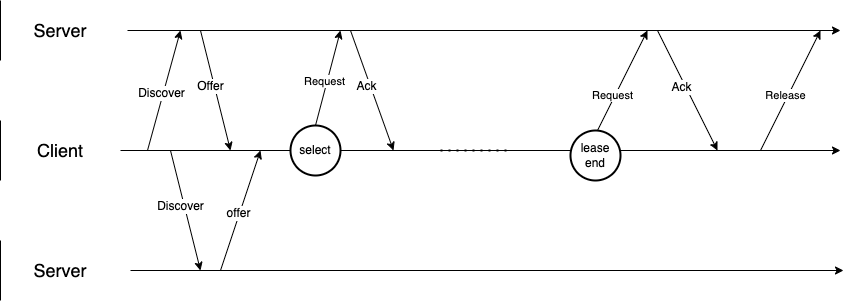

#  Dynamic Host Configuration Protocol (DHCP)

DHCP 是计算机自动获取本地网络配置的协议。

client和DHCP server的交互流程如下，client 发送一个discover请求给server要求server分配一个网络IP configuration（包括IP地址,子网掩码，DNS，gateway），server 找到一个空闲IP,作为一个offer发送给client。 如果有多个DHCP server上述过程中client会收到多个offer。Client从收到的offer选择一个并发一个request向server确认，server回复一个Ack ,client接受的ACK这个过程就结束了。申请到的IP有一个租赁期，在租赁期结束之前client会再次发送request给server进行续租。client在退出网络的时候会向服务器发送一个release，server收到release后释放IP资源。如果过期没续租的server也会释放资源。

DHCP下面一层用的是UDP协议，server的端口是67,client的端口是68。在上述过程中在client获得网络配置之前，client没有自己的IP（此时它的ip是0.0.0.0）也不知到DHCP server的地址，因此client是发送到255.255.255.255这个地址上，也就是广播（broadcat）到网络中。
