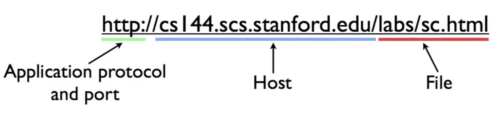
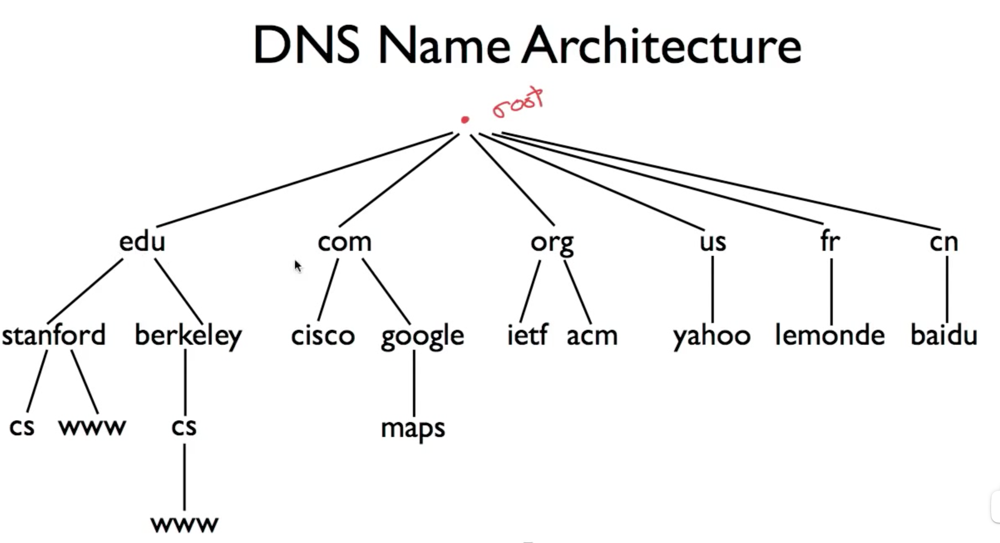
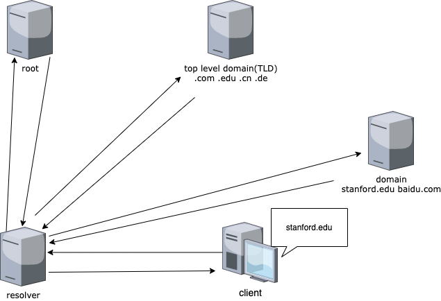

# Domain Name System(DNS)
一个http的url通常包含下图所示的三部分，其中http部分是表示协议类型是http,http的约定端口是80,host部分也就是域名，域名是方便人类阅读的而计算机网络的访问需要的是ip地址，实际上域名对应一个ip地址，DNS的作用就是找到这个域名所映射的ip地址，当然也可以反过来根据IP找到对应的域名。

DNS domain name space的层级(hierarchic)结构如下，最顶层的根服务器，根服务器记录了它的下一层"Top level domain（TLD）"服务器的地址，如edu, com. org ....。TLD服务器记录了它的的下一层"domain name"服务器的地址，domain name服务器又记录了它的下一层“sub domain name”服务器的地址。一个域名地址的形式与这个层级结构是对应的，例如"www.stanfrod.edu" 以“.”分割从右往左层级依次递减。

dns的通信主要是以UDP的方式，端口是53。以"www.stanford.edu" 这个域名为例简单阐述一下dns获取域名IP的过程。客户端向dns resolver发送一个查询请求"what is the ip address of  www.stanford.edu?" , resolver 先向根服务器查询顶层域名即edu，"who should I ask about edu?", 根服务器回应“here's some information for who you should ask about edu.”。现在resolver知道了edu所在的服务器的ip地址，同时把它放到缓存里，然后向edu发送提问"who should I ask about stanford?", edu回复“here's some information about who you should ask about stanford.”， resolver收到后同样要缓存这条信息，知道了stanford的IP地址，resolver接着向stanford服务器提问“what's the address of www”,  stanford 回答"here's the adree of www.stanford.edu'', resolver 收到后同样要缓存这条信息下一次请求相同的地址的时候不需要再向服务器查询，resolver获得了www.stanford.edu所对应的IP地址并把这个信息告知client, 完成解析过程。在上述的查询过程中，client向resolver发送的recursive查询，resolver向其他服务器发送的non-recursive查询。因为resolver是按域名的层级一个一个发送请求完全解析完成后再返回给client。而其他服务器与resolver之间是只做一个层级的解析。

