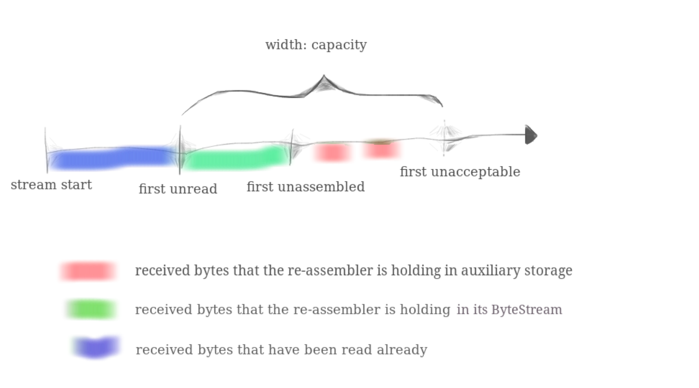
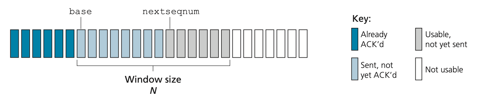
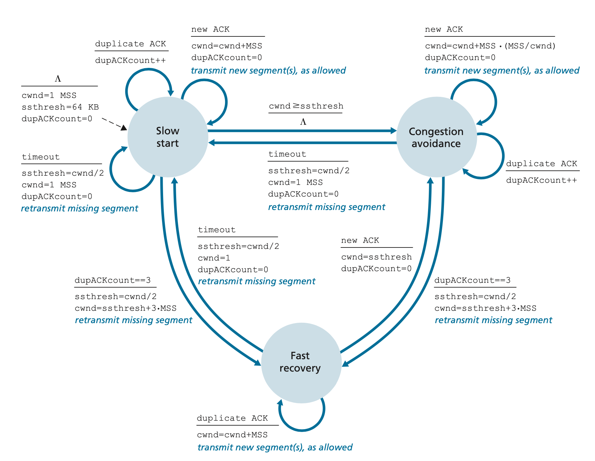
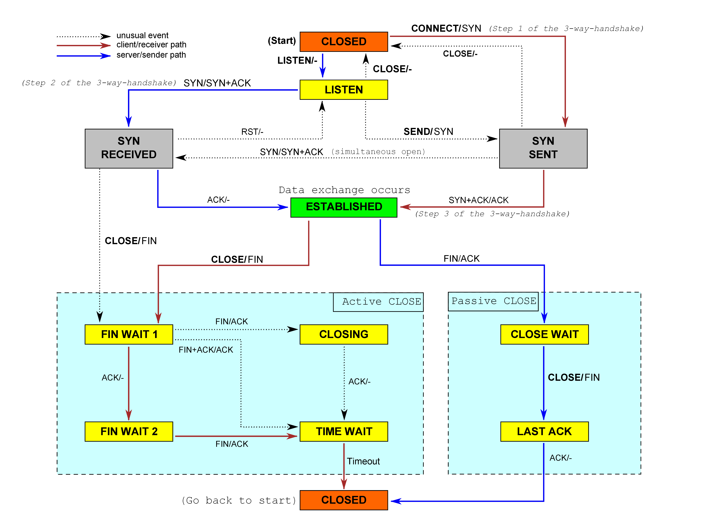
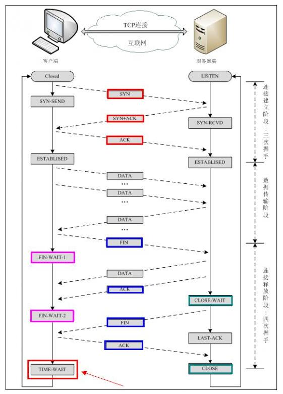
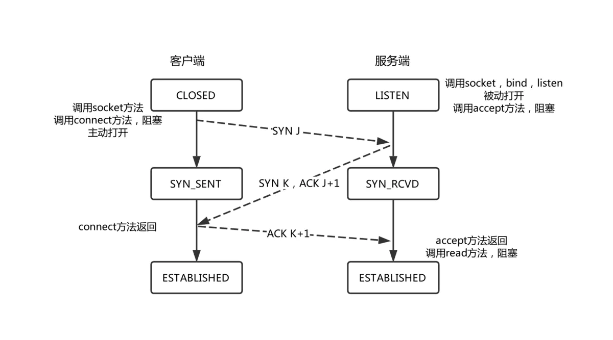
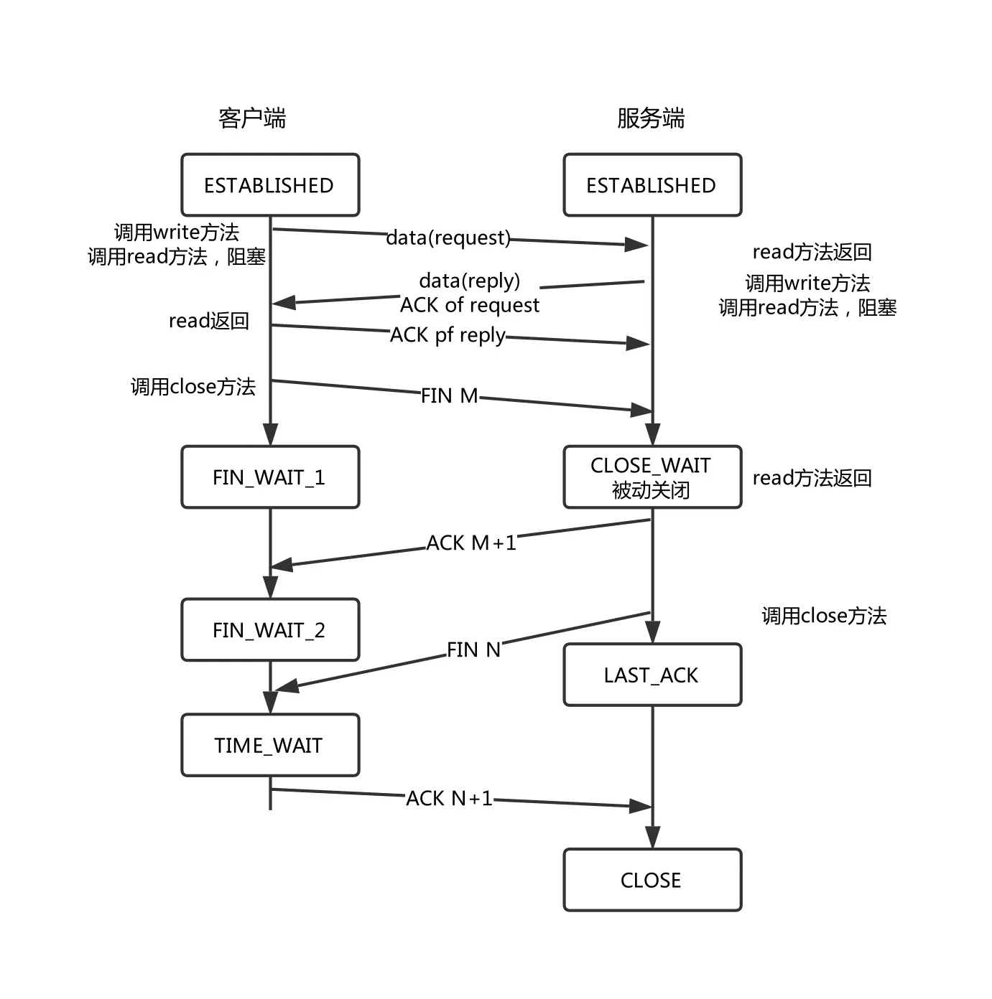
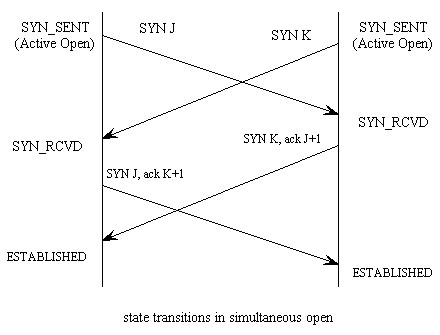
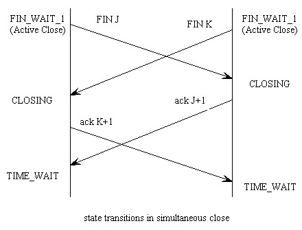

# Transmission Control Protocol (TCP) 

TCP是一种可靠传输的协议，而实现可靠和高效的传输需要用到一系列的机制，技巧和算法，下面一一介绍。

## 滑动窗口（Sliding window）

滑动窗口是实现可靠传输和控制发送速率的关键。一个TCP网络端点（endpoint）有两个滑动窗口，一个是负责接收的滑动窗口，一个是负责发送的滑动窗口.

接收的滑动窗口如下图所示，first unread到first unassembled这一段序列的数据是已经接收到并组装好准备被读取的数据。first unassembled是receiver期待sender发送的下一个包的序号，也就是要发送的acknowledge包中ackno的值。
first unassembled 到 first unacceptable 之间就是接受端缓存的剩余容量，也就是receive window 的大小，新来的数据就放到这里进行组装。receive window 是后面要用到的一个变量，表示为rwnd，它的计算公式如下：
```
rwnd= first unacceptable - first unassembled
```


发送的滑动窗口如下图所示，base是已经收到的acknowledge包中的ackno的最大值, base之前的数据都是已经确认被对方收到了的数据。TCP采用的是累积应答(cumulative acknowledgments),每收到一个应答包就表示ackno之前的所有字节都已经被对方接受成功了。nextseqnum是下一次准备发送的数据包的起始序列号。base到nextseqnum之间的数据是已经发送但是未收到应答的数据( unacknowledged bytes)，也叫outstanding bytes或bytes in flight。outstanding bytes是后面要用到一个变量，它的计算公式如下：
```
outstanding bytes = nextseqnum - base
```



## 可靠传输（Reliable data transfer）

TCP的可靠传输是靠对丢失的包重传(retransmition)实现的, 而确认一个包是否丢失要依赖超时(timeout)与重复应答(duplicate acknowledges)两种机制——duplicate acknowledges就是重复收到原来已经收到过的针对某个包的应答(ACK)。

要实现超时机制就要确定超时时间，要确定超时时间就需要知道Round-Trip Time。Round-Trip Time可以通过之前发送的包的RTT进行估算。所以要对之前发送的包的RTT进行采样得到SampleRTT。这里并不是针对每一个发送出的包都要进行采样，而是每完成一个RTT采样紧接着再进行下一次采样，也就是每隔一个RTT的时间段采样一次。估算RTT的公式为
```
EstimatedRTT = (1 – α) * EstimatedRTT +  α * SampleRTT 
```

除了要估算RTT还要计算RTT的变化性DevRTT。所谓的变化性就是EstimatedRTT与SampleRTT的偏离程度。公式如下：
```
DevRTT = (1 – β) * DevRTT + β * | SampleRTT – EstimatedRTT | 
```
如果SampleRTT的波动很小那么DevRTT的值就很小，反之就很大。

最终超时时间就是EstimatedRTT加上一个波动的margin值，这个margin值就是DevRTT，
```
TimeoutInterval = EstimatedRTT + 4 * DevRTT
```

TimeoutInterval的初始值是1 second, 每次超时的时候TimeoutInterval的值都要翻倍，但是一旦收到一个新的应答包，TimeoutInterval就又要用上面的公式计算。

综上所述，Estimating the Round-Trip Time的实现代码如下

```
TimeoutInterval = 1;

int EstimateTimeout() {
	α=0.125
	β=0.25

	EstimatedRTT = (1 – α) * EstimatedRTT +  α * SampleRTT 
	DevRTT = (1 – β) * DevRTT + β * | SampleRTT – EstimatedRTT | 
	TimeoutInterval = EstimatedRTT + 4 * DevRTT
	return TimeoutInterval;
}

```


有了超时时间就可以使用计时器了，计时器也不是对每个发出的包都要进行跟踪计时，而是只对最早的(序列号最小的)一个未应答包进行计时。


下面的代码是一个发送端的伪代码, 描述了发送包时定时器的启动，以及针对超时和重复应答的处理。
```
/* Assume sender is not constrained by TCP flow or congestion control, that data from above is less than MSS in size, and that data transfer is in one direction only. */

NextSeqNum=InitialSeqNumber 
SendBase=InitialSeqNumber
TimeoutInterval=1s

loop (forever) { 
	switch(event)

		event: data received from application above
			create TCP segment with sequence number NextSeqNum 
			if (timer currently not running) {
				start timer
			}
			pass segment to IP
			NextSeqNum=NextSeqNum+length(data) 
			break;

		event: timer timeout
			retransmit not-yet-acknowledged segment with smallest sequence number 
			TimeoutInterval *= 2;
			start timer
			break;

		event: ACK received, with ACK field value of y 
			if (y > SendBase) {
				SendBase=y
				if (there are currently any not yet acknowledged segments) {
					TimeoutInterval = EstimateTimeout() ; 
					start timer
				}
			}
			else {
				/* a duplicate ACK for already ACKed segment */
				increment number of duplicate ACKs received for y
				if (number of duplicate ACKS received for y==3)
					/* TCP fast retransmit */
					resend segment with sequence number y 
			}
			break;

} /* end of loop forever */
```

在上面的代码中，每次发送数据如果计时器没有启动就要启动计时器，也就是说计时器追踪的是已经发送且未应答包中的第一个包。每当超时发生时就认为该包已经丢失了所以要进行重传，而且超时时间要设为原来的两倍，并重新计时。当一个已经被应答过的包又收到了3次以上的重复应答也认为该包已经丢失了，所以也要进行重传。

接受端的代码如下：
```
loop (forever) { 
	event: Arrival of segment
		if (segment is in-order ) {
			if (Arrival of segment that partially or completely fills in gap in received data.) {
				Immediately send ACK, provided that segment starts at the lower end of gap.

				return;
			}

			if(All data up to expected sequence number already acknowledged.) {
				Delayed ACK. Wait up to 500 msec for arrival of another in-order segment. If next in-order segment does not arrive in this interval, send an ACK.
			} 
			else if (One other in-order segment waiting for ACK transmission.){
				Immediately send single cumulative ACK, ACKing both in-order segments.
			}
		}
		else if(segment is out-of-order) {
			// with higher-than-expected sequence number. Gap detected.
			Immediately send duplicate ACK, indicating sequence number of next expected byte (which is the lower end of the gap).
		}
}
	
```
因为TCP的每一个端点既是接受端也是发送端，所以在实际的代码实现中上述接受端和发送端是要整合到一起的。


## 流控制 （Flow Control）
为什么需要Flow Control，书里的这段话做了很好解释，“If the application is relatively slow at reading the data, the sender can very easily overflow the connection’s receive buffer by sending too much data too quickly. TCP provides a flow-control service to its applications to eliminate the possibility of the sender overflowing the receiver’s buffer. Flow control is thus a speed matching service, matching the rate at which the sender is sending against the rate at which the receiving application is reading. ”

Flow-Control 就是要保证发送端已经发送但未应答的数据量(outstanding bytes)小于接受端空闲缓存(receive window)的大小。即
```
outstanding bytes < receive window
```
关于outstanding bytes和receive window请参见滑动窗口那一节。
 

在这个方案中有一个小的技术问题。假设有两个端点A和B互相通信，并假设B的buffer已经填满即rwnd = 0，当B把rwnd = 0通知给A后，假设B没有更多的东西要发送给A了。现在考虑会发生什么事情呢？当B清空了buffer的时候，TCP没有发送带有新的rwnd值的segment给A。因为只有当B有"数据或应答"要发送的时候才会发送新的segment。所以A永远不会知道B已经释放出了新的空闲缓存。端点A就会被堵塞在那里不会发送任何数据！要解决这个问题，TCP协议标准要求端点A在这种情况下要继续发送paylaod data 为一个字节大小的segment给B。这些segments会被接受方B回复，并把新的rwnd通知到发送方A。


## 拥堵控制 （Congestion Control）
Packet retransmission 可以解决包丢失的问题达到可靠传输的目的， 但是包丢失只是问题的症状，不是问题的原因，retransmission 治标不治本。发生丢包的原因一般是网络拥堵造成的，所以要解决问题的原因就是解决网络拥堵的问题，也就是要降低发送数据的速率。这就引出了三个问题。第一，TCP如何限制发送数据的速率？第二，TCP发送端如何探测到自己到接受端之间的这段路径有拥堵现象发生？第三，如果探测道拥堵现象发生了，发送方应该使用什么策略来调整其发送速率。

首先解决第一个问题, TCP如何限制发送数据的速率。TCP的发送速率就等于`outstanding bytes / RTT`, 在滑动窗口那一节中已经知道
```
outstanding bytes = nextseqnum - base
```
，所以发送速率的公式如下

```
send rate = (nextseqnum - base) / RTT
```
现在引入一个新的变量congestion window，表示为cwnd。可以通过确保
```
outstanding bytes <= min{cwnd, rwnd}
```
来约束TCP发送端向网络发送数据的速率。通过调整cwnd的大小，发送端可依相应调整它向网络发送数据的速率。


下面解决第二个问题，TCP发送端如何探测到自己到接受端之间的这段路径有拥堵现象发生？其实，有两个迹象可以表明发送端到接受端的路径上产生拥堵了，那就是超时和三次重复应答。


最后解决第三个问题，如果探测道拥堵现象发生了，发送方应该使用什么策略来调整其发送速率？拥堵控制算法有三个阶段组成或者说是三种模式 (1) slow start, (2) congestion avoidance, and (3) fast recovery。

** Slow Start **

当TCP连接刚开始的时候，cwnd被初始化为一个1 MSS（maximum sized segments），因此它的初始发送速率就是 1MSS/ RTT。通常可用的宽带是远远大于 1MSS / RTT的，因此这时候不会发送丢包，发送端每收到一个针对发出包的应答，cwnd就增加1MSS。当第一个发送的包收到应答后TCP发送端的cwnd增加一个MSS然后发送两个MSS大小的segments。这两个segments也都分别收到了应答，发送方针对每个应答也都为cwnd新增1MSS大小，变成4MSS大小的cwnd，依次类推。这个过程导致每隔 RTT 的时间，cwnd就翻一倍，发送速率也跟着翻一倍。所以在slow start阶段TCP的发送速率是呈指数增长的。

但是这个指数增长什么时候结束呢？在Slow Start阶段有三种情况会导致数增长结束。第一是当有一个超时所表明的丢包事件发生时，TCP 发送端把cwnd设置为1MSS并重新开始slow start的过程。在这种情况下它还会把ssthresh（short hand for “slow start threshold”）变量设置为cwnd/2，即发现拥堵时的congestion window 值的一半。第二种结束的方式是Slow Start直接与ssthresh绑定。由于上次检测到拥塞时 ssthresh 是 cwnd 值的一半，因此当 cwnd 达到或超过 ssthresh 的值时继续加倍可能有点鲁莽。因此，当 cwnd 的值等于 ssthresh 时，“Slow Start”阶段结束，进入 “congestion avoidance”阶段。 TCP 在 “congestion-avoidance” 阶段会更加谨慎地增加 cwnd。慢启动结束的最后一种方式是检测到三个重复的 ACK，在这种情况下，TCP 执行 “fast retransmit” 并进入fast recovery状态。


** Congestion Avoidance **

在进入congestion-avoidance状态时，cwnd 的值大约是上次遇到拥塞时值的一半。 因此，TCP 不是在每个 RTT 时将 cwnd 的值加倍，而是采用更保守的方法并在每个 RTT 中仅将 cwnd 的值增加一个 MSS。 这可以通过多种方式实现。 一种常见的方法是 TCP 发送方在接受到acknowledgment时，将 cwnd 增加 MSS*(MSS/cwnd) 字节。 例如，如果 MSS 为 1,460 字节，cwnd 为 14,600 字节，那么在一个 RTT 内最多发送 10 个segment。 每个到达的 ACK（假设每个段一个 ACK）将拥塞窗口大小增加 1/10 MSS，因此，当收到所有 10 个段的ACK后，拥塞窗口的值将增加一个 MSS。 

但是，congestion avoidance的线性增长（每个 RTT 1 MSS）何时结束？答案同样是在由“超时和重复应答”所表明的丢包事件发生时结束。 产生“超时”表明的丢包事件时，TCP 的 congestion-avoidance算法的处理方式与slow start的情况相同：cwnd 的值设置为 1 MSS，并将 ssthresh 的值更新为 cwnd 值的一半。产生“三次重复的 ACK”所表明的丢包事件时，TCP的处理方式没有与“超时”所指示的丢包事件那么剧烈，而是将cwnd的值减半（增加3个 MSS 以作为收到的三次重复 ACK 的考量）并设置 ssthresh 的值为收到三次重复的 ACK 时的 cwnd 值的一半。 然后进入fast recovery状态。


** Fast Recovery **

在fast recovery阶段，针对丢失的segment，每收到一个重复的 ACK，cwnd 的值就会增加 1 MSS。最终，当丢失的segment的 ACK 到达时，TCP 进入congestion-avoidance阶段。与slow start 和congestion-avoidance相同，发生超时事件时，cwnd 的值设置为 1 MSS，ssthresh 的值设置为超时事件发生时cwnd值的一半，进入slow start状态：。


关于TCP的congestion control的状态转换图如下：




给前面Reliable data transfer那一节的发送端的伪代码加入congestion control的逻辑， 如下
```
MSS=500

NextSeqNum=InitialSeqNumber 
SendBase=InitialSeqNumber
cwnd=MSS
DupAckCount=0
ssthresh=64KB
TimeoutInterval=1s

function bytes_in_flight(){
	return NextSeqNum - SendBase;
}

function window(){
	reutrn min(cwnd, rwnd == 0 ？ 1 : cwnd);
}

loop (forever) { 
	switch(event)

		event: data received from application above
			while(stream has more data) {
				create TCP segment with sequence number NextSeqNum 
				segment.payload = stream.read(min(window() - bytes_in_flight(), MAX_PAYLOAD_SIZE);
				if (timer currently not running) {
					start timer
				}
				pass segment to IP
				NextSeqNum=NextSeqNum+length(segment.payload) 
			}
			break;

		event: timer timeout
			// entry slow-start
		  ssthresh=cwnd/2
		  cwnd = 1 MSS
		  DupAckCount = 0

			retransmit not-yet-acknowledged segment with smallest sequence number 
			TimeoutInterval *= 2;
			start timer
			break;

		event: ACK received, with ACK field value of y 
			if (y > SendBase) {
				SendBase=y
				if(DupAckCount > 3){
					// fast-recovery transitions to congestion-avoidence
					cwnd = ssthresh;
				} else {
					if(cwnd > ssthresh){
						// in congetion avoidence
						cwnd += MSS*(MSS/cwnd) 
					} else {
						// in slow start
						cwnd += MSS
					}
				}
				DupAckCount = 0
				if (there are currently any not yet acknowledged segments) {
					TimeoutInterval = EstimateTimeout() ; 
					start timer
				}
			}
			else {
				/* a duplicate ACK for already ACKed segment */
				DupAckCount++;
				if (DupAckCount==3){
					// entry fast-recovery
					ssthresh = cwnd/2
					cwnd = ssthresh + 3 MSS
					/* TCP fast retransmit */
					resend segment with sequence number y 
				} else if (DupAckCount > 3) {
					// in fast-recovery
					cwnd += MSS

				}
					
			}
			break;

} /* end of loop forever */
```


## TCP  Connection Management———Connection建立，Connection关闭，状态转换

关于TCP的建立连接的三路握手(three-way handshake)和关闭连接的四路挥手是老黄历了，直接上示意图就能明白了,如果一个不够就多上几个

[The TCP Finite State Machine][3]示意图如下


TCP connection的建立和关闭的示意图如下



另外这篇[博文][1]对TCP连接的11种状态做了很好的分析。


值得一提的是那个TIME_WAIT状态，TCP主动关闭的一端要在这个状态保持2倍的MSL（最大段生存期）才会结束。之所以这样做有两个原因，一是当被动关闭的一端也发送FIN给主动关闭的一端的时候，如果主动端收到了会回复一个ACK, 但是主动端无法获知被动端是否收到了这个ACK，因为没有针对ACK的ACK。假若被动端没有收到ACK，就会重复发送FIN，所以主动端要等待一端时间如果没有收到重复的FIN就确认对方确实收到了针对FIN的ACK了，反之如果收到了重复的FIN就继续回复ACK。二是，假设在主机12.106.32.254的1500端口和206.168.112.219的21端口之间有一个TCP连接。此连接关闭后，在相同的地址和端口建立了另外一个连接。由于IP地址和端口相同，所以后一种连接被称为先前连接的“化身”。TCP必须防止连接中的旧副本在稍后再次出现，并被误解为属于同一连接的新“化身”。为此，TCP将不会启动当前处于TIME_WAIT状态的连接的新“化身”。由于一个已经发送的数据包会在MSL的时间后过期，因此 2 MSL保证了一个Round-Trip（发送与回复）的数据都会过期。通过强制执行此规则，可以保证当一个TCP连接成功建立时，来自先前连接的所有旧的副本在网络中已过期。


还有一些特殊但是不常见的情况，比如两端同时发送SYN建立连接，或同时发送FIN关闭连接，这里有一篇[博文][2]对者两种情况做了很好的分析，我直接搬过来了。
## 1. Simultaneous Open

It's possible for two applications to send a SYN to each other to start a TCP connection, although the possibility is small, because both sides have to know which port on the other side to send to. This process is called "Simultaneous Open", or "simultaneous active open on both sides".

For example: An application at host A uses 7777 as the local port and connects to port 8888 on host B. At the same time, an application at host B uses 8888 as the local port and connects to port 7777 on host A. This is "Simultaneous Open".


TCP is specially designed to deal with "Simultaneous Open", during which only one TCP connection is established, not two. The state transitions are shown in the following figure:



During "Simultaneous Open", 4 packets are exchanged, 1 packet more than in normal situations.

## 2. Simultaneous Close
It's permitted in TCP for both sides to do "active close", which is called "Simultaneous Close". The state transitions are shown in the following figure:



During "Simultaneous Close", 4 packets are exchanged, the same as in normal situations.


[1]: https://www.51cto.com/article/619189.html
[2]: https://ttcplinux.sourceforge.net/documents/one/tcpstate/tcpstate.html
[3]: http://tcpipguide.com/free/t_TCPOperationalOverviewandtheTCPFiniteStateMachineF-2.htm
